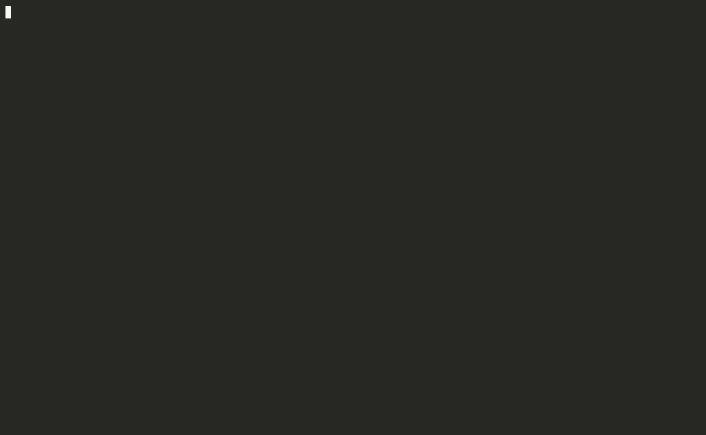
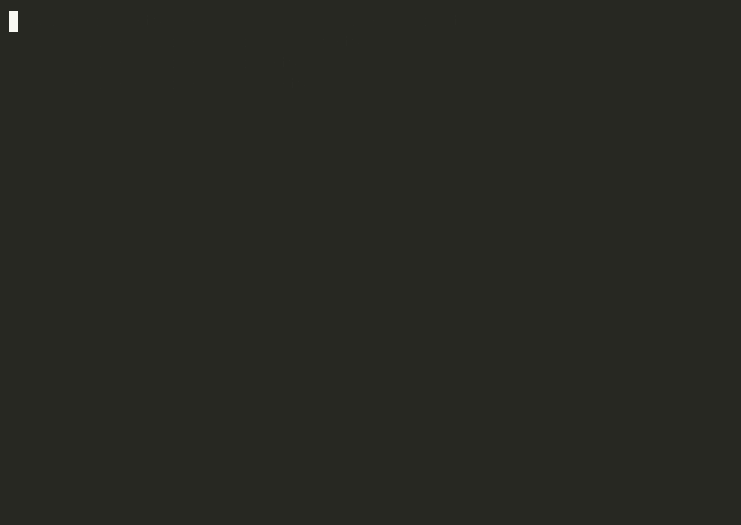

<p align="center">
  
</p>

# knixl

knixl generates maintainable, human-readable Nix from small amounts of opinionated KDL.

Pronounced "nix-ull". Written in Rust. KDL is the source of truth, the generated Nix is a committed build artefact, and regeneration is version-aware so a framework upgrade cannot change your output without telling you first.

<p align="center">
  
</p>

## What it does

You write a few lines of KDL:

```kdl
host "web" {
    system "x86_64-linux"
    web-service "example.com" {
        upstream "http://127.0.0.1:3000"
        acme email="ops@example.com"
        hardened #true
    }
}
```

knixl expands it into a full, idiomatic NixOS module (nginx enabled, TLS and proxy recommendations on, ACME wired up, security headers added), formats it with a pinned formatter, writes it to `generated/`, and records hashes in a lockfile so the output is reproducible byte-for-byte.

The whole loop is compile, check, and read back the typed reference for any node:

<p align="center">
  
</p>

## Install

There is no release binary yet, so build it from a checkout. You need a Rust toolchain (the repo pins 1.87.0 via `rust-toolchain.toml`, rustup will pick it up):

```sh
git clone https://github.com/1stvamp/knixl
cd knixl
cargo build --release        # or: mise run build
```

The binary lands at `target/release/knixl`. Put it on your PATH, or run it in place.

For `generate`, `check`, and `install` you also need:

- **Nix** on PATH, for the oracle (option-path validation) and for `install`'s package eval.
- **a formatter**: `nixfmt-rfc-style` or `nixfmt` on PATH. `KNIXL_FORMATTER` overrides which binary is used.

**Note:** without the oracle's `options.json` cache populated, path validation is quietly skipped, so a typo'd option path will not be caught. See docs/06-oracle.md for the cache.

## Quickstart

A knixl project is a directory with a `hosts/` folder. Declarative modules, when you have them, live in a `modules/` folder alongside it. knixl walks up from the current directory to the first folder that has `hosts/` or `knixl.lock.kdl`, and treats that as the root.

```sh
mkdir -p demo/hosts && cd demo
cat > hosts/web.kdl <<'EOF'
host "web" {
    system "x86_64-linux"
}
EOF

knixl plan        # missing generated/hosts/web.nix
knixl generate    # writes generated/hosts/web.nix and knixl.lock.kdl
knixl check       # clean
```

From there, add a module node (`web-service`, `postgres`, `backups`, ...) to the host and regenerate. `knixl doc <node>` prints what a node accepts before you write it.

## The model in four points

- **KDL is authoritative.** Generated Nix is derived and disposable. There is no round-trip from edited Nix back to KDL (that is a tar pit, see ADR 0001).
- **Override via the module system, not by editing generated files.** Anything expressed as a NixOS option is overridable from a sibling module with `lib.mkForce` / `lib.mkAfter`. Structural choices (which files, which modules) change at the KDL layer.
- **Escape hatch:** a `raw-nix` passthrough node for inline snippets, or just import a hand-written `.nix` module alongside. knixl does not need to model all of Nix, only provide a clean seam.
- **Reproducible + version-aware:** `output = f(kdl, tool_version, module_versions, formatter_version, oracle_rev)`, deterministic to the byte. A lockfile pins all five. Regeneration is a reconcile, and a version bump is opt-in and reviewable.

## Commands

- `knixl check` : CI gate. Exits 0 only if every generated file matches the lock. Never writes.
- `knixl plan` : recompute and report, write nothing.
- `knixl generate` : apply. Silent for input changes, refuses hand-edited (tainted) files without `--accept-drift`, refuses version skew (points you at `upgrade`).
- `knixl upgrade` : the only path that bumps recorded versions. Shows migration notes and a diff, applies on `--yes`.
- `knixl doc <node>` : typed reference for a module node, generated from its schema.
- `knixl install <pkg>` : add a package to a host. Drafts the KDL, verifies it under nix, previews, then regenerates. `pkg@version` pins the package to a nixpkgs commit. On a real terminal it opens the TUI install screen; piped or `--yes` it uses a plain confirm.
- `knixl tui` : the interactive hub (shown above). Install a package, browse registered modules and their schemas, or author a new declarative module (build its schema and emit template, validated live as you type).

## Drift and versions

A generated file that someone hand-edited is **tainted**. knixl tells drift apart from a stale input by a third hash, and refuses to silently overwrite a human's edit:

<p align="center">
  
</p>

## Key terms

- **Clean** : the generated file matches what its inputs and versions produce. Nothing to do.
- **Stale** : an input (KDL) changed, so a regeneration is owed. `generate` fixes it.
- **Drifted** : the generated file was hand-edited (tainted). `generate` refuses it without `--accept-drift`.
- **Missing** : the file should exist and does not. **Orphaned** : it exists but no host claims it (deleted only with `--prune`).
- **taint** : the whole-file drift concept. A hand-edit taints the file, because a partial re-merge would lose the edit silently (ADR 0004).
- **oracle** : the NixOS option set knixl validates emitted paths against, built from a pinned nixpkgs rev (ADR 0003).
- **baseline** : a per-host nixpkgs rev. A host may declare `nixpkgs release="25.05"`, resolved to a commit at install/upgrade time (ADR 0007).
- **pin strategy** : how a version-pinned package is emitted, `override` or `commit-mix`, chosen automatically at pin time (ADR 0005/0006).

## Examples

`examples/` holds five worked hosts (`db`, `web`, `shared`, `pinned`, `pinned-override`) with their golden Nix output under `examples/expected/` and the matching lock. They double as the acceptance tests. To run them from a checkout the repo-root `modules/` directory must sit alongside (the declarative modules `web-service` and `security-headers` live there). See examples/README.md.

## Status

v1 is built: `check`, `plan`, `generate`, `upgrade`, `doc`, `install`, and `tui` work, all example hosts reproduce byte-for-byte through the pinned nixfmt, and the oracle validates emitted paths against the NixOS option set. The backlog and in-flight work live in GitHub issues; design specs are under `docs/superpowers/specs/`.

## Prior art

Nothing does KDL to committed Nix source. The ecosystem goes the other way (home-manager `toKDL`, niri-flake, the `pkgs.formats.kdl` request all generate KDL from Nix). Nickel exports to JSON/YAML/TOML, not Nix source. dhall-to-nix emits Nix but at eval time as normalised values, and cannot express callPackage, overlays, or the module system. terranix is the closest structural precedent (a DSL compiling to target config), just mirrored. See docs/00-overview.md for the full write-up.

## Licence

Licensed under either of Apache License, Version 2.0 (LICENSE-APACHE) or the MIT licence
(LICENSE-MIT) at your option. Unless you state otherwise, any contribution you submit for
inclusion is dual licensed as above, with no additional terms.
